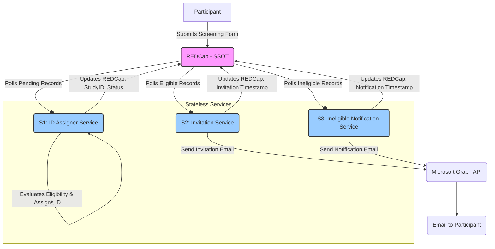

# Automated REDCap Recruitment Pipeline

[](https://www.python.org/downloads/)
[](https://pypi.org/)

A fully automated, 24/7 participant recruitment pipeline integrating REDCap and Microsoft Graph API. This Python-based system autonomously manages eligibility screening, Study ID assignment (HC/MDD), personalized email communications via Microsoft Bookings, and comprehensive weekly enrollment reporting.

## Table of Contents

- [Overview](#overview)
- [Key Features](#key-features)
- [System Architecture and Workflow](#system-architecture-and-workflow)
- [Core Components](#core-components)
- [Technology Stack](#technology-stack)
- [Prerequisites](#prerequisites)
- [Installation and Setup](#installation-and-setup)
- [Configuration](#configuration)
- [Microsoft Graph Authentication](#microsoft-graph-authentication)
- [Deployment (Systemd)](#deployment-systemd)
- [Usage and Monitoring](#usage-and-monitoring)

## Overview

This pipeline automates the traditionally manual process of participant recruitment. By integrating REDCap with the Microsoft Graph API, it provides a seamless flow from initial screening to appointment booking, ensuring timely communication and accurate data management.

## Key Features

- **24/7 Autonomous Operation:** Runs continuously as `systemd` services with automatic restart on failure.
- **Real-Time Eligibility Screening:** Immediate evaluation based on centralized criteria (Age, Location, Language, Contraindications, QIDS scores).
- **Dynamic Study ID Assignment:** Automated assignment of IDs based on group (e.g., Healthy Control: 3000+, MDD: 10200+).
- **Microsoft Graph Integration:** Secure email communication using OAuth2 with automatic token refresh (MSAL).
- **Microsoft Bookings Scheduling:** Sends personalized invitations with links for participants to self-schedule E-Consent sessions.
- **Privacy Protection:** Instructs participants to use only their Study ID (not their real name) when booking appointments.
- **Professional Notifications:** Automated, neutral communications for ineligible participants.
- **Comprehensive Reporting:** Generates detailed weekly HTML reports with enrollment funnel visualizations and metrics.

## System Architecture and Workflow

The pipeline operates as a series of stateless microservices that use REDCap as the Single Source of Truth (SSOT).



### Data Flow Summary (SSOT Architecture)

1. A participant submits the REDCap screening form.
2. **[S1] ID Assigner** polls REDCap for pending records, evaluates eligibility using `EligibilityChecker`:
   - **Eligible:** Updates REDCap with Study ID and `pipeline_processing_status = 'eligible_id_assigned'`
   - **Ineligible:** Updates REDCap with `pipeline_processing_status = 'ineligible'` and reasons
   - **Review Required:** Updates REDCap with `pipeline_processing_status = 'manual_review_required'`
3. **[S2] Invitation Service** polls REDCap for `pipeline_processing_status = 'eligible_id_assigned'`. Sends Microsoft Bookings invitations via MS Graph API and updates REDCap with `pipeline_invitation_sent_timestamp` and `pipeline_processing_status = 'eligible_invited'`.
4. **[S3] Ineligible Notification Service** polls REDCap for `pipeline_processing_status = 'ineligible'`. Sends notifications via MS Graph API and updates REDCap with `pipeline_ineligible_notification_sent_timestamp` and `pipeline_processing_status = 'ineligible_notified'`.

### Key SSOT Principles

- **No Local State:** All services are stateless - no SQLite databases for tracking participant status
- **REDCap as Truth:** All participant state is stored in REDCap fields
- **Idempotent Operations:** Services can be restarted at any time without losing state
- **Concurrency Safety:** Built-in retry mechanisms for handling race conditions during ID assignment
- **Independent Authentication:** Each service manages its own MSAL token cache

## Core Components

### Services

| Service | Filename | Description |
|---------|----------|-------------|
| **S1: ID Assigner** | `eligible_id_assigner.py` | The core service. Polls REDCap for pending records, applies eligibility rules with QIDS validation, assigns Study IDs (HC/MDD) with concurrency handling, and updates REDCap status fields. |
| **S2: Invitation Service** | `outlook_autonomous_scheduler.py` | Monitors REDCap for eligible participants (`pipeline_processing_status = 'eligible_id_assigned'`) and sends personalized invitations with Microsoft Bookings links. Uses independent MSAL authentication with automatic token refresh. |
| **S3: Ineligible Notifier** | `send_ineligible_emails_fixed.py` | Monitors REDCap for ineligible participants (`pipeline_processing_status = 'ineligible'`) and sends professional notifications. Has independent MSAL authentication - not dependent on S2. |

### Utility Modules

| Module | Filename | Description |
|--------|----------|-------------|
| **Eligibility Checker** | `eligibility_checker.py` | Contains the centralized business logic and criteria for determining participant eligibility. |
| **REDCap Client** | `redcap_client.py` | A wrapper class for handling all interactions with the REDCap API (exporting/importing records). |

## Technology Stack

- **Languages:** Python 3.10+
- **Data Source:** REDCap (via API) - Single Source of Truth
- **External APIs:** Microsoft Graph API (Email sending, OAuth2), Microsoft Bookings
- **Libraries:** `requests`, `msal` (Microsoft Authentication Library), `pandas`, `matplotlib`, `seaborn`, `python-dotenv`, `urllib3` (for retry strategies)
- **Persistence:** REDCap fields only (no local SQLite databases)
- **Authentication:** MSAL with file-based token caching (`.auth_cache_*.json`)
- **Deployment:** Systemd user services

## Prerequisites

- **Python:** Version 3.10 or higher
- **REDCap:** An active project with API access enabled (Token required)
- **Azure AD Application:** A registered application with the following **Delegated** permissions for Microsoft Graph:
  - `Mail.Send.Shared` (To send mail on behalf of the lab account)
  - `Mail.Send`
  - `User.Read`
- **Operating System:** Linux environment capable of running `systemd` user services

## Installation and Setup

1. **Clone the repository:**

   ```bash
   git clone https://github.com/PrecisionNeuroLab/Automated-REDCap-Recruitment-Pipeline.git
   cd Automated-REDCap-Recruitment-Pipeline
   ```

2. **Set up a Python virtual environment and install dependencies:**

   ```bash
   python3 -m venv venv
   source venv/bin/activate
   pip install requests python-dotenv pandas matplotlib seaborn msal urllib3
   ```

3. **Create necessary directories:**

   ```bash
   mkdir -p logs reports/charts
   ```

4. **Configure REDCap Fields (Required for SSOT):**

   Ensure your REDCap project has these fields for state tracking:
   - `pipeline_processing_status` (Radio/Dropdown): Values: 'pending', 'eligible_id_assigned', 'ineligible', 'manual_review_required', 'eligible_invited', 'ineligible_notified'
   - `pipeline_ineligibility_reasons` (Text)
   - `pipeline_invitation_sent_timestamp` (Datetime)
   - `pipeline_ineligible_notification_sent_timestamp` (Datetime)

## Configuration

Create a `.env` file in the root directory and add the necessary credentials.

```dotenv
# REDCap Configuration
REDCAP_API_URL=https://redcap.your_institution.edu/api/
REDCAP_API_TOKEN=YOUR_REDCAP_API_TOKEN

# Azure AD / Microsoft Graph Configuration
# (The Tenant and Client IDs below are specific to the provided implementation)
AZURE_TENANT_ID=396573cb-f378-4b68-9bc8-15755c0c51f3
AZURE_CLIENT_ID=3d360571-8a54-4a1b-9373-58d35333d068
AZURE_CLIENT_SECRET=YOUR_AZURE_APPLICATION_CLIENT_SECRET

# Optional: Allow test emails (bypass rate limits for specific addresses if set to 'true')
ALLOW_TEST_EMAILS=false
```

## Microsoft Graph Authentication

The pipeline uses delegated authentication via MSAL to send emails autonomously. Each service manages its own authentication independently.

1. **Ensure Redirect URI:** Verify that the Azure Application's redirect URI is set to `http://localhost:8000` for the initial authentication flow.

2. **Initial Authentication for Each Service:**

   Each service needs to be authenticated once:

   ```bash
   # Authenticate the Invitation Service
   python outlook_autonomous_scheduler.py --test

   # Authenticate the Ineligible Notification Service
   python send_ineligible_emails_fixed.py --once
   ```

3. **Browser Login:** A browser window will open for each service. Log in using the account that has delegation rights (e.g., `tristan8@stanford.edu`) to the sender account (e.g., `kellerlab@stanford.edu`).

4. **Token Storage:** Each service stores its authentication tokens in separate MSAL cache files:
   - Invitation Service: `.auth_cache_scheduler.json`
   - Ineligible Notification Service: `.auth_cache_ineligible.json`

The services will automatically refresh access tokens as needed using MSAL's built-in token management. Each service is independent and doesn't rely on other services for authentication.

## Deployment (Systemd)

For robust, 24/7 operation, the pipeline is designed to run as user-level `systemd` services. This ensures the services start automatically at boot and restart if they fail.

*Note: Setting up the specific `.service` files requires defining the `ExecStart` paths based on your installation directory. Refer to the project documentation for example configurations.*

1. **Enable User Lingering:**

   This allows user services to run even when the user is not logged in.

   ```bash
   loginctl enable-linger $USER
   ```

2. **Install and Start Services:**

   After placing the `.service` definition files into `~/.config/systemd/user/`:

   ```bash
   systemctl --user daemon-reload
   systemctl --user enable redcap-id-assigner redcap-email-scheduler redcap-ineligible-emails
   systemctl --user start redcap-id-assigner redcap-email-scheduler redcap-ineligible-emails
   ```

## Usage and Monitoring

### Running Services Manually (For Testing)

You can run services manually if needed.

```bash
# Run ID Assigner once
python eligible_id_assigner.py --once

# Run Invitation Scheduler continuously
python outlook_autonomous_scheduler.py
```

### Monitoring Services

Check the status of the services using `systemctl`:

```bash
systemctl --user status redcap-id-assigner
systemctl --user status redcap-email-scheduler
```

### Viewing Logs

To view real-time logs using `journalctl` (if deployed via systemd):

```bash
# View ID Assigner logs
journalctl --user -u redcap-id-assigner -f

# View Invitation Service logs
journalctl --user -u redcap-email-scheduler -f
```

Logs are also written directly to the `./logs` directory (e.g., `logs/outlook_autonomous.log`).

### Service Overview

The pipeline consists of three core services:
- **ID Assigner Service** (`eligible_id_assigner.py`)
- **Invitation Service** (`outlook_autonomous_scheduler.py`)
- **Ineligible Notification Service** (`send_ineligible_emails_fixed.py`)

All services query REDCap directly for current state (SSOT architecture).
